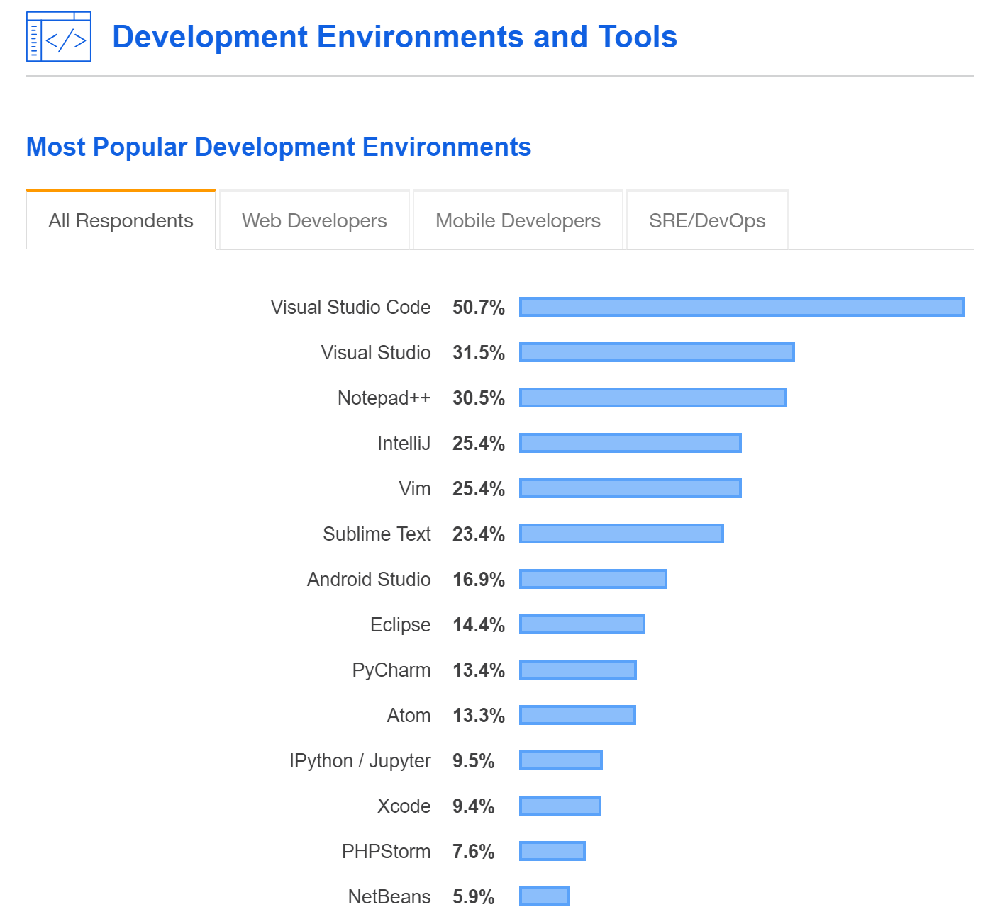
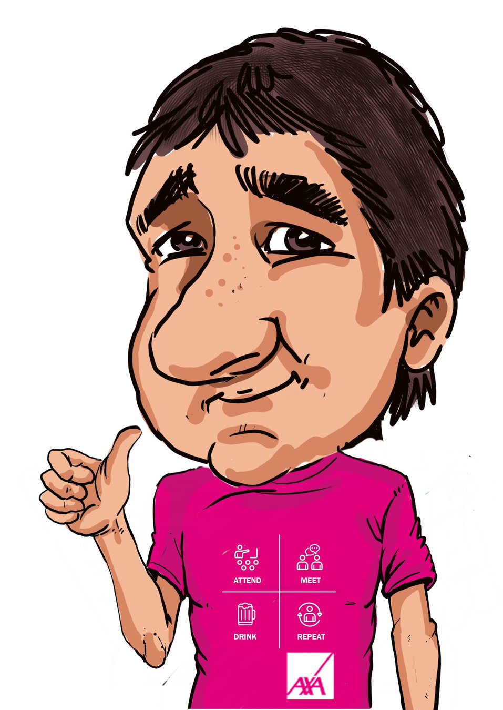
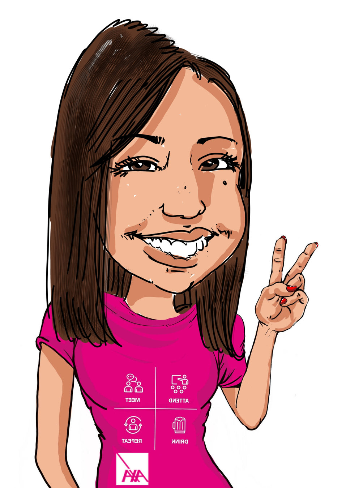

# Collaborer avec VSCode

<small>By [@TiffanySouterre](https://twitter.com/TiffanySouterre) and [@olivierleplus](https://twitter.com/olivierleplus)</small>

---

<small> source: <a href="https://insights.stackoverflow.com/survey/2019">stackoverflow</a></small>

---

<!-- .slide: data-background="#ffffff" -->

<table border="0">
  <tr style="border: solid 0px;">
    <td style="border: 0px;">Olivier Leplus</td>
    <td style="border: 0px;">Tiffany Souterre</td>
  </tr>
  <tr>
    <td style="border: 0px;">@olivierleplus</td>
    <td style="border: 0px;">@TiffanySouterre</td>
  </tr>
  <tr>
    <td style="border: 0px;">DevRel at Microsoft</td>
    <td style="border: 0px;">Data engineer at JEMS</td>
  </tr>
  <tr>
    <td style="border: 0px;"></td>
    <td style="border: 0px;"></td>
  </tr>
</table>

---

# Links

[CodeStream](marketplace.visualstudio.com/items?itemName=CodeStream.codestream)

[Debugger for Chrome](marketplace.visualstudio.com/items?itemName=msjsdiag.debugger-for-chrome)

[Github Pull Request](marketplace.visualstudio.com/items?itemName=GitHub.vscode-pull-request-github)

[Slack / Discord / Liveshare](marketplace.visualstudio.com/items?itemName=karigari.chat)

[Live Share whiteboard](https://marketplace.visualstudio.com/items?itemName=lostintangent.vsls-whiteboard)

[Pomodoro](https://marketplace.visualstudio.com/items?itemName=lostintangent.vsls-pomodoro)

-

[Bracket Pair Colorizer](marketplace.visualstudio.com/items?itemName=CoenraadS.bracket-pair-colorizer)

[Cobalt2 Theme Official](marketplace.visualstudio.com/items?itemName=wesbos.theme-cobalt2)
